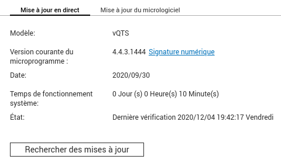
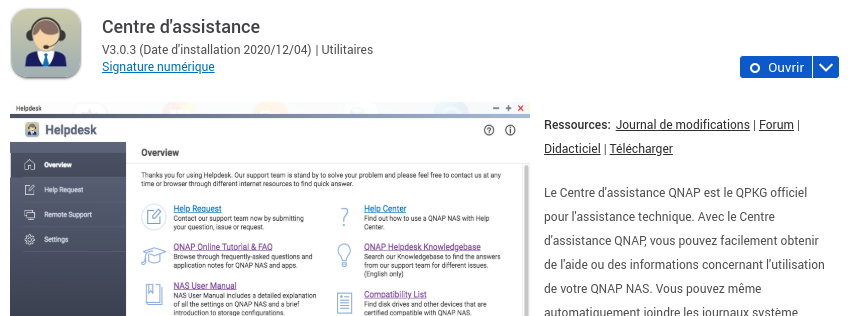
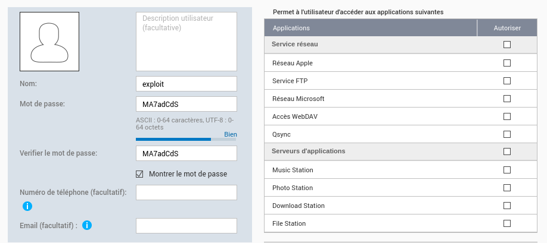
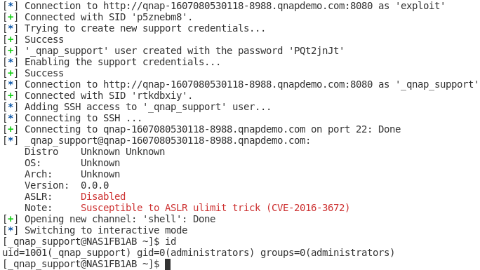

# Helpdesk : A simple user without privileges is able to gain administrative access on the NAS

## Information

CVE: [CVE-2021-28814](https://cve.mitre.org/cgi-bin/cvename.cgi?name=CVE-2021-28814)

Advisory : [QSA-21-25](https://www.qnap.com/fr-fr/security-advisory/qsa-21-25)

QTS Version : vQTS 4.4.3.1444

HelpDesk : 3.0.3 (08/10/2020)

Bug Hunter : Thomas FADY (thomas.fady@gmail.com)

I'm the QNAP online demo environment to perform security tests. The QTS ans HelpDesk version are updated to the latest available version. QTS is updated via the QNAP interface and the HelpDesk application is updating by uploading the [latest package archive](https://download.qnap.com/QPKG/helpdesk_3.0.3-20200810_master.zip).

## Timeline (DD/MM/YYYY)

- 04/12/2020 : Bug sent to QNAP security team
- 07/12/2020 : QNAP confirms the report reception
- 30/01/2021 : Update requested on bug status
- 01/02/2021 : QNAP confirms the bug
- 08/04/2021 : Fix is published with Helpdesk 3.0.4
- 11/06/2021 : Security advisory published on the QNAP website

## Summary

A simple user can access dangerous endpoints on **HelpDesk** allowing to create a **_qnap_support** account, get his password and activate his account on the system. The created account is in the **administrators** group. An SSH access with **administrators** privileges  can be enabled with this account.

## Preparation

### System and package upgrade

First, we need to ensure that the system and HelpDesk package are up to date.





### User Account Creation

To exploit the vulnerability, we need user credentials. We can create a user "**exploit**" with password "**MA7adCdS**". This user doesn't require any privileges.



## Exploitation

To exploit the vulnerability, we need few steps:

- Connect with a valid user
- Access **/apps/qdesk/api/v1/remote_access/getkeys** URL to generate a new support account
- Access **/apps/qdesk/api/v1/remote_access/enable** to enable this account
  - At this step, the support account is usable in the web interface
- Add **_qnap_support** user to ssh group
- Connect to SSH with this user





## Explanation

The first problem is that dangerous entry points are not restricted to the administrator. Indeed, the user doesn't need access to :

- **/apps/qdesk/api/v1/remote_access/getkeys**
- **/apps/qdesk/api/v1/remote_access/enable**

Then, the "**enable**" endpoint, need two **POST** parameters :

- email
- ticketId

The ticketId is verified by making a request on [https://help.qnap.com/apps/qdesk_service/api/v1/qpkg/remote/{ticketId}](https://help.qnap.com/apps/qdesk_service/api/v1/qpkg/remote/{ticketId}) 

```php
// www/App/Models/RemoteAccessModel.php
public function getRemoteSessionStatus()
    {
        $curlUrl = 'https://' . config('helpdesk_server') . "/apps/qdesk_service/api/v1/qpkg/remote/{$this->ticketId}";
        $srvOutput = curlWrapper('GET', $curlUrl);
        if (is_array($srvOutput)) {
            $srvOutput = json_encode($srvOutput);
        }
        $srvOutput = json_decode($srvOutput);

        if (isset($srvOutput->status) && $srvOutput->status === 'FALSE') {
            if (isset($srvOutput->result->errCode) && $srvOutput->result->errCode == 28) {
                return array('status' => '408', 'msg' => $srvOutput->result->errMsg);
            } else {
                return $srvOutput->status;
            }
        }

        $ticketStatus = $srvOutput->status;
        if ($ticketStatus == 0) {
            $ticketStatus = $srvOutput->data->status;
        }

        return $ticketStatus;
    }
```

If the "**ticketId**" variable contains a new line character, "**$srvOutput**" will be `NULL`. All checks in the **enable** function will fail to catch the error.


```php
// www/App/Controllers/Api/RemoteAccess.php
public function enable()
{		
    	[...]
    	if (is_array($remoteStatus)) {
            $objRStatus = json_encode($remoteStatus);
            $objRStatus = json_decode($objRStatus);

            if (isset($objRStatus->status)) {
                Response::error($objRStatus->status, apiFormater($objRStatus->msg, 2014));
            }
        }

        if ($remoteStatus == 1001 || $remoteStatus == 1002) {
            $this->fileLogModel->logDebug('Remote access case is already enabled.', __FILE__, __LINE__);
            Response::error(403, apiFormater(null, 2007));
        }

        if ($this->remoteAccessModel->isExist($ticketId, $email) && $remoteStatus == 1004) {
            $this->fileLogModel->logDebug('Remote access case is already expired.', __FILE__, __LINE__);
            Response::error(403, apiFormater(null, 2018));
        }

        if ($this->remoteAccessModel->isExist($ticketId, $email) && $remoteStatus == 1005) {
            $this->fileLogModel->logDebug('Remote access case is already closed.', __FILE__, __LINE__);
            Response::error(403, apiFormater(null, 2009));
        }

        if ($remoteStatus == 1) {
            $this->fileLogModel->logError('Remote access case is not activate.', __FILE__, __LINE__);
            Response::error(404, apiFormater(null, 2010));
        }
    
    	// Fix SSHD config permission
        $this->qtsModel->fixSSHDConfigPerm();

        // Generate SSH Keypair
        $privateKey = file_get_contents($this->tmpKeyPath);
        $publicKey = shell_exec("/usr/bin/ssh-keygen -y -f $this->tmpKeyPath");

        $pattern = '/[\\r\\n]/';
        $pkWithTicketID = preg_replace($pattern, '', $publicKey) . ' ' . $ticketId . "\r\n";

        $this->remoteAccessModel->resetAuthedKey();

        file_put_contents($this->authedKeyPath, $pkWithTicketID, FILE_APPEND);
        $base64SK = base64_encode($privateKey);

        // Check and create QTS account
        $tempAccount = $this->remoteAccessModel->getTempAccount();
        $supportID = $tempAccount['tempId'];
        $supportPW = $tempAccount['tempPw'];

        $this->remoteAccessModel->removeQTSUserByAPI();
        if ($this->remoteAccessModel->checkQTSUser()) {
            $this->remoteAccessModel->removeQTSUser();
            if ($this->remoteAccessModel->checkQTSUser()) {
                $this->fileLogModel->logError('Can not remove QTS support account.', __FILE__, __LINE__);
                Response::error(500, apiFormater(null, 2010));
            }
        }

        $this->remoteAccessModel->qtsUserPW = $supportPW;
        $po = $this->remoteAccessModel->createQTSUserByAPI();
        if (!$this->remoteAccessModel->checkQTSUser()) {
            $this->remoteAccessModel->createQTSUser();
            if (!$this->remoteAccessModel->checkQTSUser()) {
                $this->fileLogModel->logError('Can not create QTS support account.', __FILE__, __LINE__);
                Response::error(500, apiFormater(null, 2011));
            }
        }

        //set config to close popup
        $this->remoteAccessModel->setQTSUserConfig();

        // Get NAS http, https and ssh port
        if (empty($httpPort) && empty($sshPort)) {
            $httpPort = shell_exec("/sbin/getcfg 'System' 'Web Access Port' -d 8080");
            $httpsPort = shell_exec("/sbin/getcfg 'Stunnel' 'Port' -d 443");
            $sshPort = shell_exec("/sbin/getcfg 'LOGIN' 'SSH Port' -d 22");
            $httpPort = str_replace("\n", '', $httpPort);
            $httpsPort = str_replace("\n", '', $httpsPort);
            $sshPort = str_replace("\n", '', $sshPort);
        }
```

The function will crash after this code but the support account is enabled now.

## Remediation

To fix these vulnerabilities, few steps are required:

- Check admin permissions on required routes
- Verify the **ticketId** format with a regex
